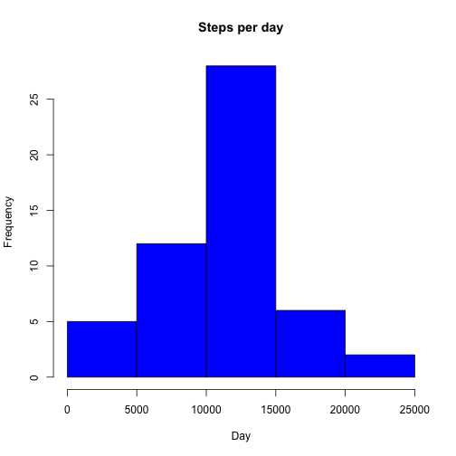
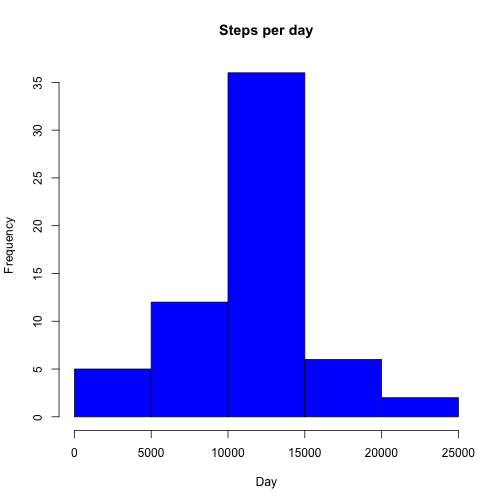
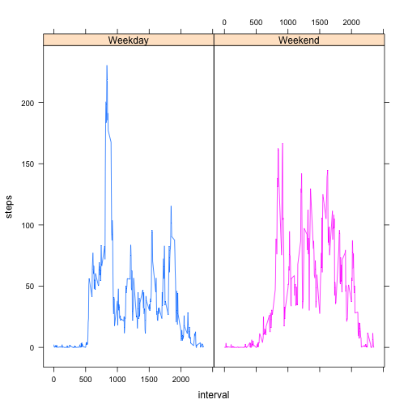

This is an R Markdown document for assignment 1 of the Coursera Reproducible Research course to analyze the data from a personal activity monitoring device.  The personal activity data for the assignment was obtained from the course website at: https://d396qusza40orc.cloudfront.ne/repdata%2Fdata%2Factivity.zip.  The data was downloaded and read using the following code: 

## Loading and preprocessing the data


```r
temp <- tempfile()
download.file(url = "https://d396qusza40orc.cloudfront.net/repdata%2Fdata%2Factivity.zip",destfile = temp, method = "curl")
data <- read.csv(unz(temp, "activity.csv"), stringsAsFactors = FALSE)
```


## What is mean total number of steps taken per day?


```r
use <- c(TRUE, TRUE, FALSE)
d2 <- aggregate(. ~ date, data[,use], sum)
d2$date <- strptime(d2$date, "%Y-%m-%d")
hist(x=d2$steps, main = "Steps per day", xlab = "Day", ylab = "Frequency", col = "blue", freq=TRUE)
```

 

```r
mean(d2$steps)
```

```
## [1] 10766.19
```

```r
median(d2$steps)
```

```
## [1] 10765
```


## What is the average daily activity pattern?
The following time series plot shows the daily activity pattern of the 5 minute interval (x-axis) and the average number of steps taken averaged across all days (y-axis)


```r
d3 <- aggregate(. ~ interval, data[,c(TRUE,FALSE,TRUE)], FUN=mean)
plot(x=d3$interval, y=d3$steps, xlab="Interval", ylab="Steps", type = "l")
```

 

From the time series plot, the 5 minute interval that contains the maximum number of steps on average is obtained by

```r
d3[which.max(d3$steps),]
```

```
##     interval    steps
## 104      835 206.1698
```
 

## Imputing missing values
There are xxx NA values in the data. To imput the missing values, the average number of steps is computed for each 5 minute interval and the used to replace any NAs for that 5 minute interval.


```r
names(d3) <- c("interval", "avg_steps")
d3$interval <- NULL
data <- cbind(data,d3)
data$steps[is.na(data$steps)] <- data$avg_steps[is.na(data$steps)]
d2 <- aggregate(. ~ date, data[,use], sum)
d2$date <- strptime(d2$date, "%Y-%m-%d")
hist(x=d2$steps, main = "Steps per day", xlab = "Day", ylab = "Frequency", col = "blue", freq=TRUE)
```

 

The new mean and media for the imputed data set is:


```r
mean(d2$steps)
```

```
## [1] 10766.19
```

```r
median(d2$steps)
```

```
## [1] 10766.19
```

## Are there differences in activity patterns between weekdays and weekends?
A panel plot of the weekday vs. weekend data shows more activity on a weekday morning vs. a weekend morning.


```r
library(lattice)
weekend <- c("Saturday", "Sunday")
data$date <- strptime(data$date, "%Y-%m-%d")
weekdays_vec <- weekdays(data$date)

criteria <- weekdays_vec %in% weekend
data <- cbind(data,criteria)

## Use subset to separate the weekend from the weekday data.
weekday_data <- subset(data, criteria == FALSE, select = c(steps, interval))
weekend_data <- subset(data, criteria == TRUE, select= c(steps, interval))

## Compute the average across all weekdays, and the average across weekends.
weekday_data <- aggregate(.~ interval, weekday_data[,c(TRUE,TRUE)], FUN=mean)
weekend_data <- aggregate(.~ interval, weekend_data[,c(TRUE,TRUE)], FUN=mean)

## Add day_type to identify whether the data is for a weekday or a weekend.
weekday_data$day_type <- c("Weekday")
weekend_data$day_type <- c("Weekend")

## Create a new data set containing both the averaged weekday data and the averaged weekend data.
new_data <- rbind(weekday_data, weekend_data)

## Generate the panel plot
xyplot(steps ~ interval | day_type, new_data, type = "l", identifier = "Weekday", group = day_type, horizontal = FALSE)
```

 
